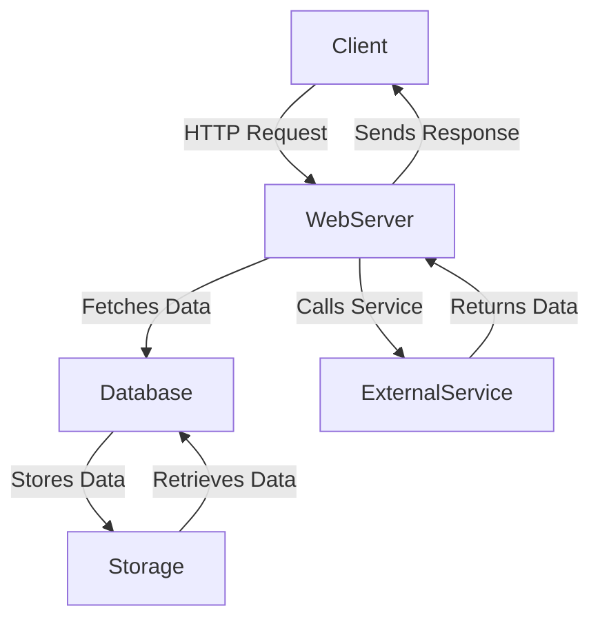

# my-project

```mermaid
graph TD
    Client -->|HTTP Request| WebServer
    WebServer -->|Fetches Data| Database
    WebServer -->|Sends Response| Client
    WebServer -->|Calls Service| ExternalService
    ExternalService -->|Returns Data| WebServer
    Database -->|Stores Data| Storage
    Storage -->|Retrieves Data| Database
```
