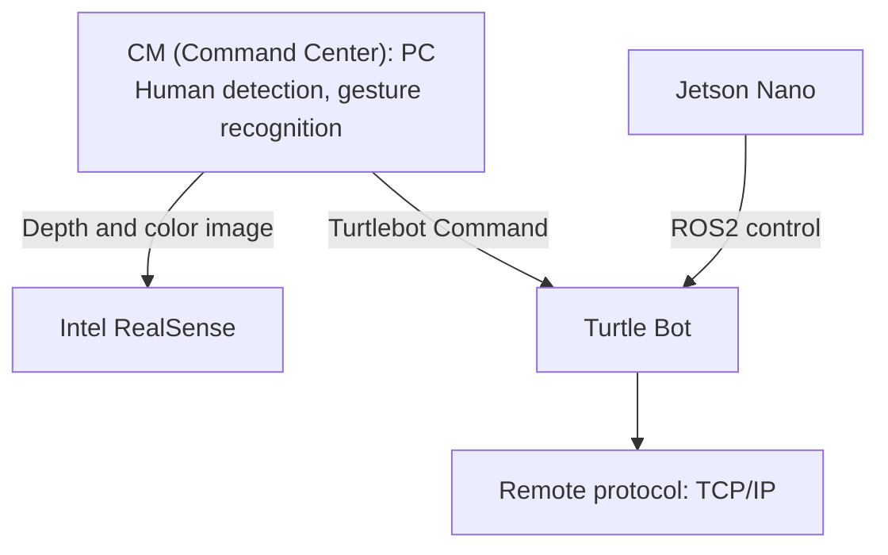

# my-project

```mermaid
graph TD
    CM["CM (Command Center): PC<br>Human detection, gesture recognition"]
    IntelRealSense["Intel RealSense"]
    JetsonNano["Jetson Nano"]
    TurtleBot["Turtle Bot"]
    RemoteProtocol["Remote protocol: TCP/IP"]

    CM -->|Depth and color image| IntelRealSense
    CM -->|Turtlebot Command| TurtleBot
    JetsonNano -->|ROS2 control| TurtleBot
    TurtleBot --> RemoteProtocol
```

# HLD1

# HLD2

# HLD

