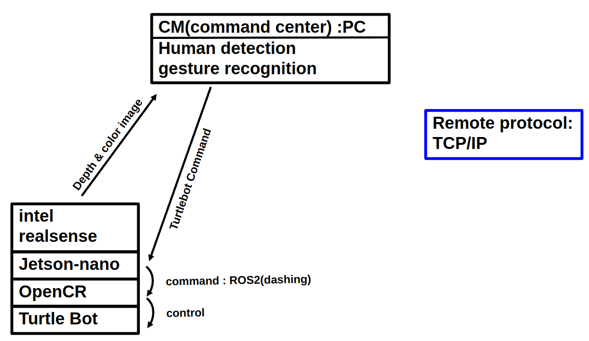

# my-project

# HLD1

# HLD2

# HLD1

# HLD2

# finished job
1. ROS를 통한 turtle bot control Check
2. jetson nano와 intel realsense connection Check
3. 라즈베리에서 intel realsense 사용 불가 Check
4. mediapipe 를 사용한 hand gesture recognition Check

# current job
은찬, 태섭 : 통신 속도 정상화, turtlebot 제어 코드 refactoring, frame 처리 및 동작 제어 threading ,제스쳐 명령 수행
동현, 의근 : 
